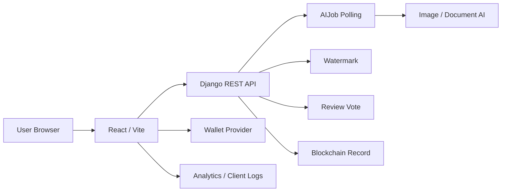
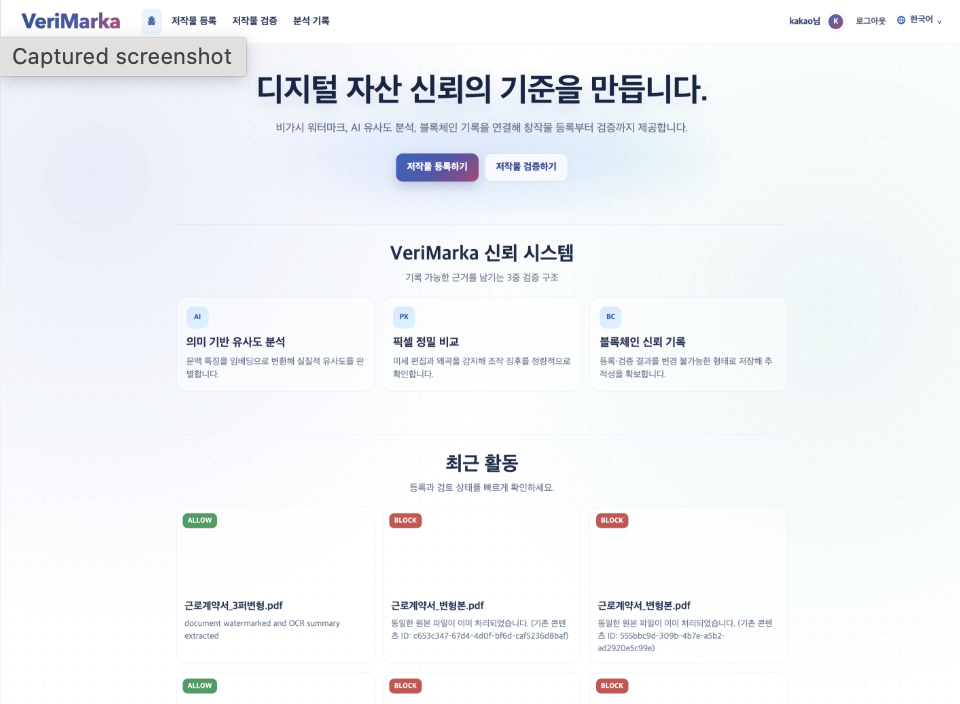
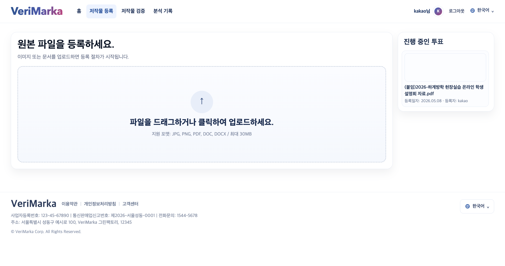
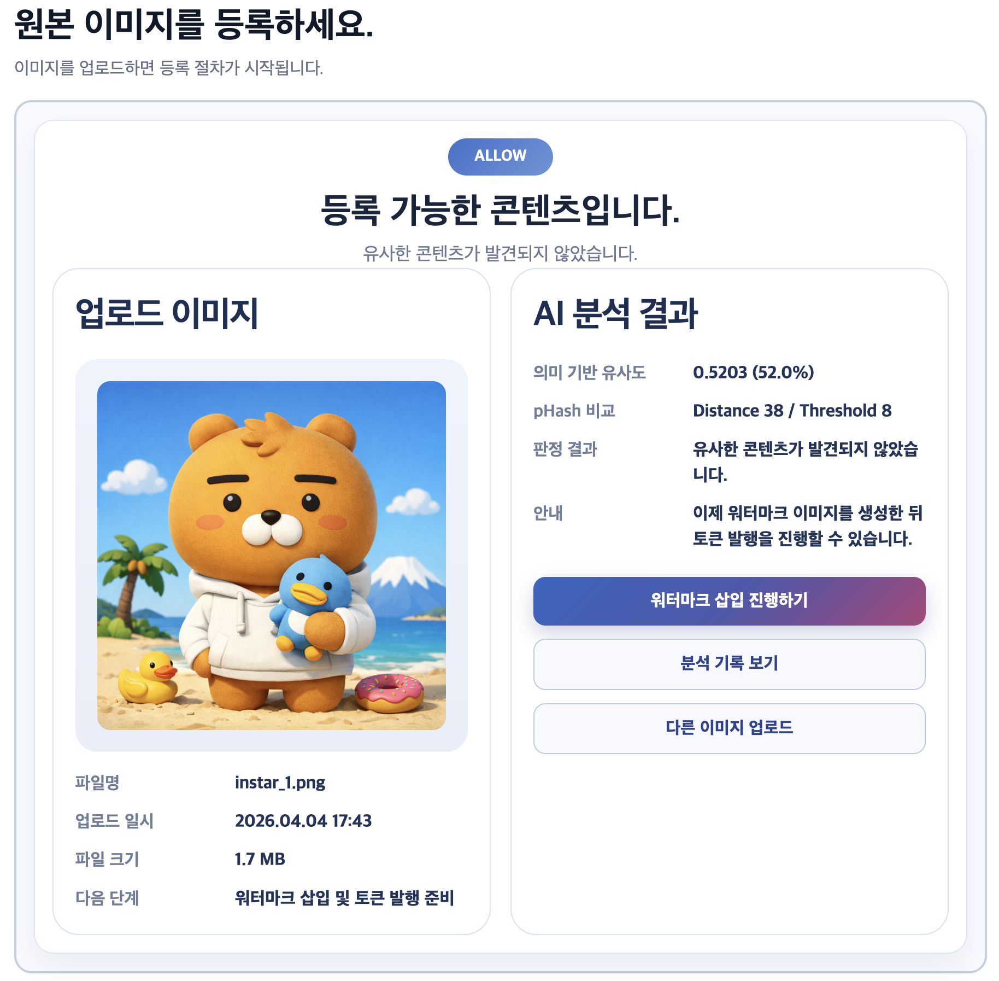
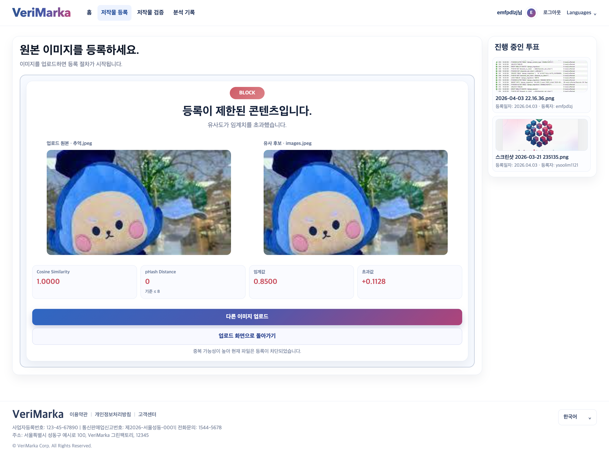
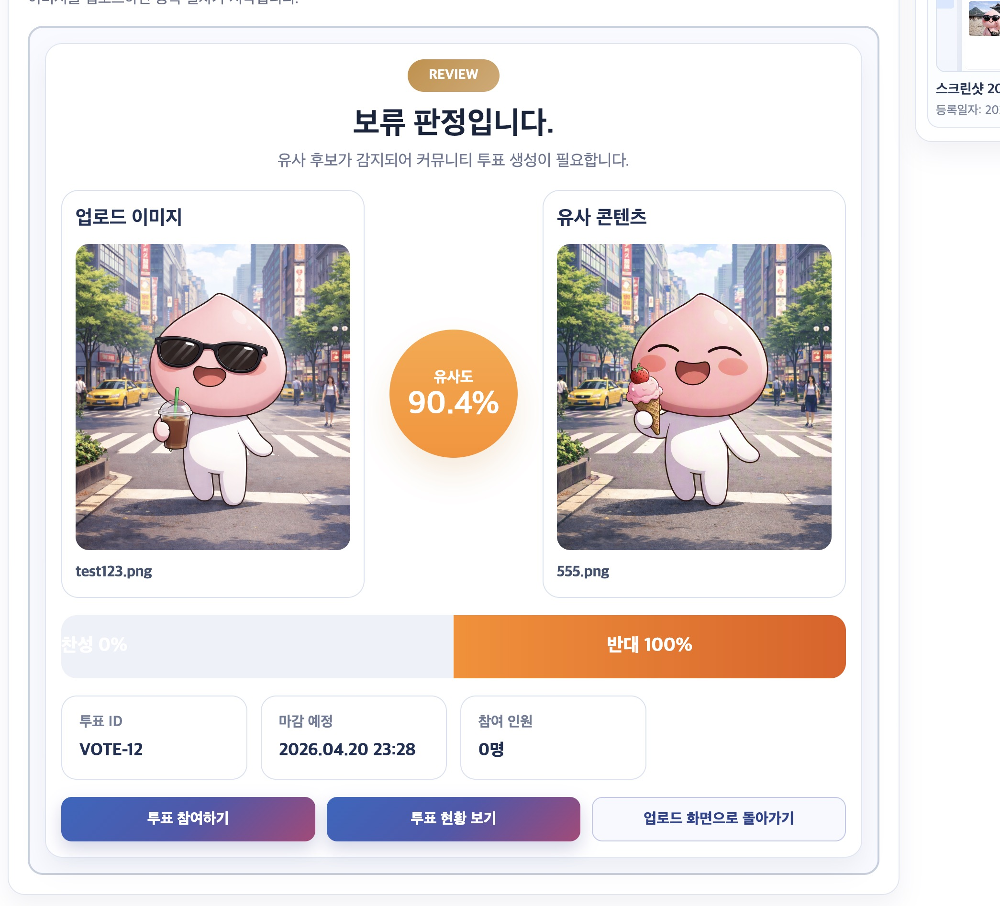
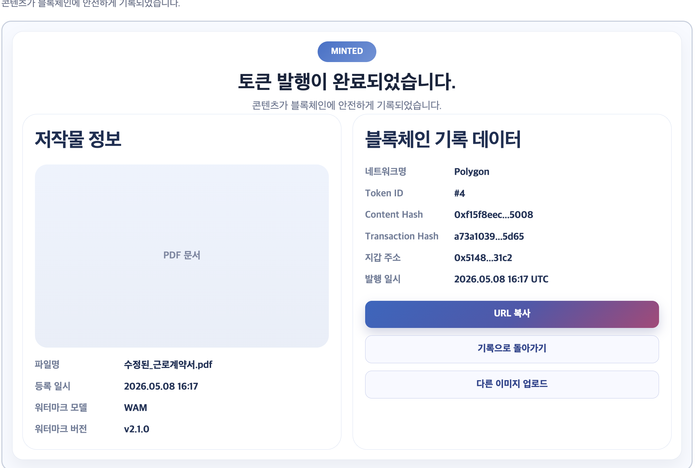
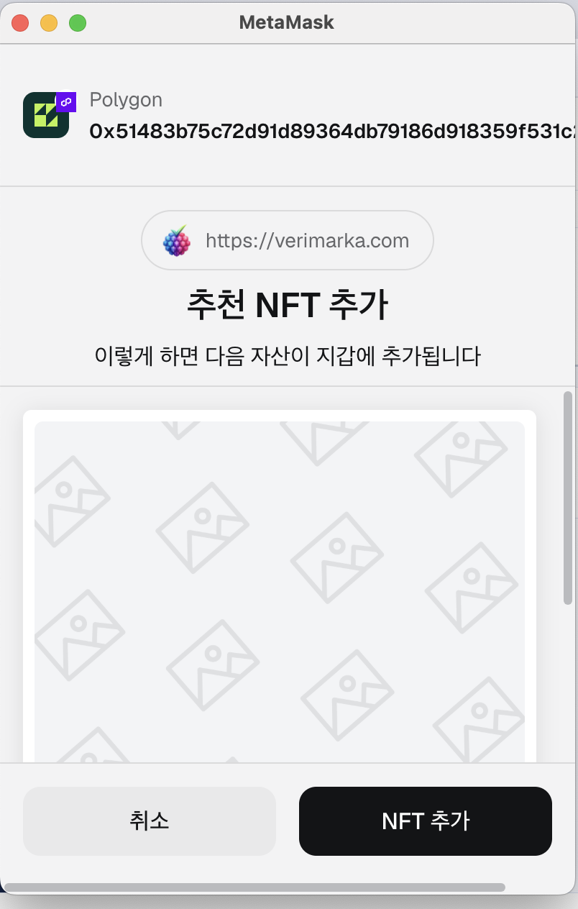
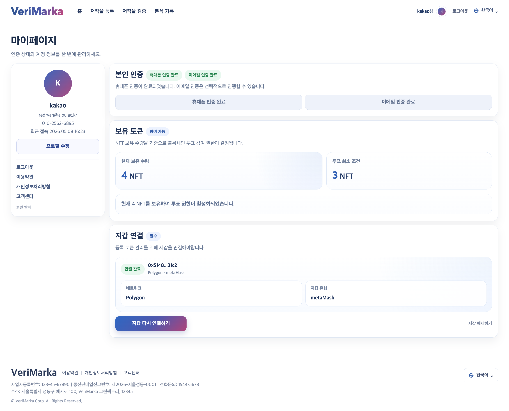
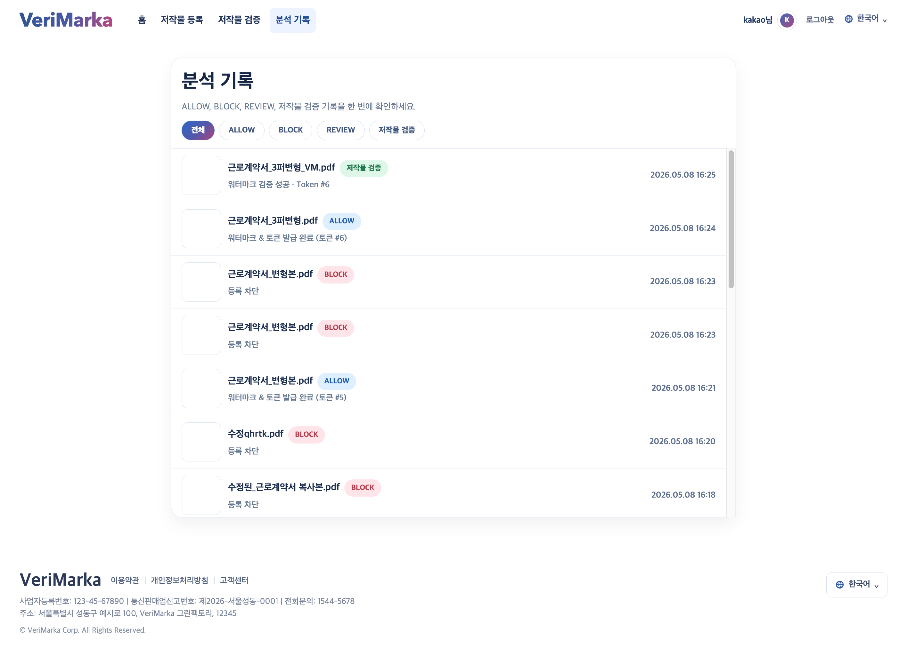

# Verimarka Frontend

AI 저작물 등록, 검증, 투표, 워터마크 다운로드, 지갑 연결, NFT 발급 흐름을 제공하는 사용자용 React 프론트엔드입니다.

기존 개발/운영 인수인계 문서는 [HANDOFF.md](./HANDOFF.md)에 보존했습니다.

## 1. 프로젝트 한 줄 소개

Verimarka는 AI 생성 이미지와 문서의 등록 가능성을 분석하고, 워터마크와 블록체인 기록을 통해 저작물의 소유 및 검증 이력을 남기는 서비스입니다.

## 2. 개발 배경

AI 생성 이미지와 문서가 늘어나면서 사용자는 내가 만든 결과물이 등록 가능한지, 등록 이후 어떻게 검증할 수 있는지, 그리고 그 기록을 어떻게 공유할 수 있는지 한 화면 흐름 안에서 확인할 필요가 있습니다. 사용자 프론트엔드는 복잡한 AI 판정, 투표, 지갑 연결, NFT 발급 절차를 사용자가 따라갈 수 있는 단계형 경험으로 제공하는 데 초점을 맞췄습니다.

## 3. 주요 기능

| 영역 | 기능 |
| --- | --- |
| 사용자 경험 | 홈, 로그인, 회원가입, 마이페이지, 내 정보 수정, 기록 조회 |
| 인증 | 이메일 로그인/회원가입, Google/Kakao/Apple OAuth callback, 휴대폰/이메일 인증 모달 |
| 저작물 등록 | 이미지/문서 업로드, AI 분석 진행률 표시, `ALLOW`/`REVIEW`/`BLOCK` 결과 화면 |
| 워터마크/NFT | 워터마크 삽입 요청, 전/후 비교, 워터마크 파일 다운로드, 민팅 결과 확인 |
| 투표 | REVIEW 대상 비교 화면, 지갑 서명 기반 투표 참여, 투표 현황/결과 상세 |
| 지갑 | MetaMask/WalletConnect 연결, Polygon 네트워크 전환, NFT watch asset 흐름 |
| 검증 | 검증 파일 업로드, 워터마크/블록체인 검증 결과, 후보 콘텐츠 비교 |
| SEO/글로벌 | 한국어/영어/일본어/중국어 i18n, prerender, canonical, OG, Twitter Card, sitemap, robots, llms.txt |
| 운영 | request id 기반 클라이언트 로깅, Sentry browser 연동, Google Analytics 준비 |

## 4. 기술 스택

| 구분 | 사용 기술 |
| --- | --- |
| Frontend | React 19, TypeScript, Vite |
| Routing/Data | React Router 7, TanStack Query |
| Wallet | wagmi, viem, WalletConnect, Polygon |
| i18n | i18next, react-i18next |
| SEO | SSR prerender script, route SEO config, sitemap/robots/llms.txt |
| Quality | TypeScript strict mode, ESLint |
| Deploy | Vite build, Nginx static hosting, GitHub Actions |

## 5. 서비스 흐름

## 6. 화면 캡처

| 화면 | 캡처                                                            | 설명 |
| --- |---------------------------------------------------------------| --- |
| 홈 |    | 서비스 진입 화면과 주요 등록/검증 플로우로 이동하는 시작점입니다. |
| 저작물 등록 |  | 파일 업로드 후 AI 분석 진행 상태와 결과를 단계적으로 보여줍니다. |
| 승인 결과 |   | `ALLOW` 결과에서 워터마크/NFT 발급으로 이어지는 화면입니다. |
| 차단 결과 |     | 중복 또는 유사 콘텐츠 판단 시 이유와 비교 후보를 보여줍니다. |
| 투표 |     | REVIEW 상태의 저작물을 비교하고 지갑 서명 기반으로 투표합니다. |
| 문서 승인 |      | PDF/DOC/DOCX 등록 결과와 문서 워터마크 처리 결과를 표시합니다. |
| 지갑 |    | 지갑 연결 상태, 네트워크, NFT 발급 조건을 확인합니다. |
| 마이페이지 |        | 계정, 인증, 지갑, 활동 정보를 한 화면에서 관리합니다. |
| 기록 |       | 등록/검증/투표 이력과 블록체인 기록을 확인합니다. |

## 7. 내가 맡은 역할

- 박준서: AI 담당
- 임윤수: 블록체인 담당
- 박민정: 사용자 프론트엔드 전체 화면과 백엔드 API 연동 - 홈/인증/마이페이지/AI 등록/검증/투표/지갑/NFT 발급 흐름을 구현

## 8. 기술적으로 고민한 점

| 고민 | 해결 방향 | 구현 포인트 |
| --- | --- | --- |
| AI 작업이 즉시 끝나지 않아 사용자가 현재 상태를 알기 어려움 | 업로드 응답의 `job_id`를 기준으로 진행 상태를 이어서 표시 | 등록/검증/워터마크 단계마다 progress ring, toast, 결과 화면을 분리 |
| `ALLOW`, `REVIEW`, `BLOCK`마다 가능한 액션이 다름 | 백엔드의 `decision`, `next_action`, `watermark`, `blockchain` 값을 기준으로 버튼을 제어 | 허용 결과는 워터마크/NFT, 검토 결과는 투표, 차단 결과는 후보 비교 중심으로 UI 분기 |
| 지갑 연결은 사용자의 브라우저/확장 프로그램 상태에 크게 의존함 | connector 정규화, Polygon 네트워크 전환, 오류 메시지 분리를 구현 | MetaMask 유사 provider 구분, WalletConnect project id 유무에 따른 연결 옵션 제어 |
| CSR만으로는 검색/공유 미리보기가 약함 | Vite build 후 SSR prerender를 실행 | 주요 라우트별 HTML, title, description, canonical, OG, Twitter Card, JSON-LD를 생성 |
| 다국어 화면과 SEO 메타가 따로 놀 수 있음 | locale route와 SEO config를 함께 관리 | 한국어/영어/일본어/중국어 문구와 `og:locale`을 함께 변경 |
| 운영 오류를 백엔드 로그와 연결해야 함 | 클라이언트 request id를 생성해 모든 API 요청에 포함 | 민감정보는 redaction 후 로깅하고, API 오류는 Sentry context에 request id/response id를 포함 |

## 9. 트러블슈팅 / 성과

| 문제 | 원인 | 해결 |
| --- | --- | --- |
| 액세스 토큰 만료 시 여러 API가 동시에 refresh를 호출 | 각 요청이 독립적으로 401을 처리함 | `refreshInFlight`를 두어 refresh 요청을 하나로 합치고 성공/실패 이벤트를 전파 |
| 대용량 이미지 또는 문서 미리보기에서 레이아웃이 깨짐 | 결과 유형마다 이미지 비율과 문서 높이가 달라짐 | 비교 카드, 프레임, 진행 오버레이의 반응형 CSS를 분리하고 모바일에서 세로 배치로 전환 |
| 워터마크 완료 후 사용자가 NFT 발급을 나중에 이어가기 어려움 | 워터마크 결과와 블록체인 민팅 상태가 같은 단계처럼 보임 | 워터마크 완료 화면과 민팅 화면을 분리하고 기록 화면에서 미발급 상태를 이어서 처리 |
| 투표 종료 후에도 참여 UI가 남아 UX 혼선 발생 | 블록체인 투표 상태와 프론트 상태 갱신 타이밍 차이 | 상세 조회/상태 갱신 시 투표 상태를 다시 동기화하고 종료 상태는 결과 화면으로 전환 |
| SEO 태그가 SPA 진입점에만 남아 공유 품질이 낮음 | 정적 호스팅 환경에서 route별 HTML이 없음 | prerender 스크립트로 주요 경로별 `index.html`을 생성해 검색/공유 메타를 보강 |

## 10. 실행 방법

실행 방법은 [docs/SETUP.md](./docs/SETUP.md)를 참고하세요.
