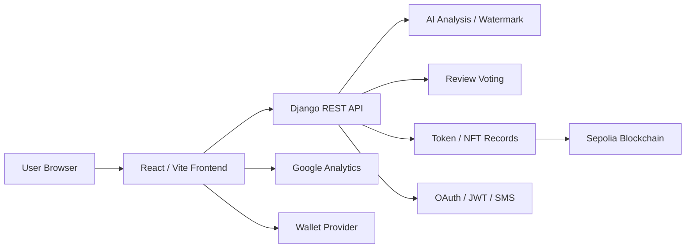

# Verimarka Frontend

AI 저작물 등록, 검증, 투표, 워터마크 다운로드, NFT 발급 흐름을 제공하는 사용자용 React 프론트엔드입니다.

기존 개발/운영 인수인계 문서는 [HANDOFF.md](./HANDOFF.md)에 보존했습니다.

## 1. 프로젝트 한 줄 소개

Verimarka는 AI 생성 이미지의 저작권 등록 가능성을 분석하고, 워터마크와 NFT 발급을 통해 저작물의 소유 및 검증 기록을 남기는 서비스입니다.

## 2. 개발 배경

AI 생성 이미지가 늘어나면서 사용자는 내가 만든 이미지가 등록 가능한지, 등록 이후 어떻게 검증할 수 있는지, 그리고 그 기록을 어떻게 공유할 수 있는지 한 화면 흐름 안에서 확인할 필요가 있습니다. 사용자 프론트엔드는 복잡한 AI 판정, 투표, 지갑 연결, NFT 발급 절차를 사용자가 따라갈 수 있는 단계형 경험으로 제공하는 데 초점을 맞췄습니다.

## 3. 주요 기능

- 홈, 로그인, 회원가입, 마이페이지, 내 정보 화면
- Google/Kakao OAuth 로그인과 일반 회원가입 UI
- 회원가입 입력값 실시간 검증 및 비밀번호 정책 안내
- AI 저작물 등록 이미지 업로드
- 등록 가능 여부 판정 결과 표시: `ALLOW`, `REVIEW`, `BLOCK`
- 워터마크 삽입 가능 여부 확인 및 권한별 버튼 제어
- 워터마크 이미지 다운로드
- 저작물 검증 업로드 및 결과 확인
- REVIEW 상태 투표 참여 및 투표 결과 자세히보기
- 지갑 연결, NFT 발급 흐름, 토큰 기록 조회
- 개인정보처리방침, 이용약관, 고객센터/FAQ 연결
- SEO, Open Graph, Twitter Card, robots.txt, sitemap.xml, llms.txt
- 영어, 중국어, 일본어 다국어 지원
- Google Analytics 기반 사용자 행동 분석 준비

## 4. 기술 스택

- Frontend: React 19, TypeScript, Vite
- Routing/Data: React Router, TanStack Query
- Blockchain Wallet: wagmi, viem, WalletConnect
- i18n: react-i18next, i18next
- SEO/Analytics: meta tags, Open Graph, sitemap, Google Analytics
- Quality: ESLint, TypeScript build
- Deploy: GitHub Actions, Nginx static hosting

## 5. 시스템 아키텍처 그림

## 6. 역할 분담
- 박준서: AI 담당
- 박민정: 웹 풀스택 담당
- 임윤수: 블록체인 담당

## 7. 기술적으로 고민한 점

- AI 분석 결과가 즉시 끝나지 않는 상황을 고려해 업로드, 대기, 결과, 후속 액션이 끊기지 않도록 상태 흐름을 구성했습니다.
- `ALLOW`, `REVIEW`, `BLOCK`별로 가능한 버튼과 안내가 달라지므로, 백엔드 상태와 프론트 권한 처리를 일관되게 맞췄습니다.
- 지갑이 없는 사용자도 워터마크 삽입까지는 진행할 수 있게 하고, NFT 발급은 지갑 연결 이후 자연스럽게 이어지도록 UX를 분리했습니다.
- CSR 기반 SEO 한계를 보완하기 위해 페이지별 title, description, canonical, OG, Twitter Card, sitemap, robots, llms.txt를 적용했습니다.
- 다국어 상태에 따라 주요 페이지 메타와 화면 문구가 함께 바뀌도록 구성했습니다.

## 8. 트러블슈팅 / 성과

- 파일 업로드 이미지 크기에 따라 업로드 영역 높이를 조정해 미리보기와 결과 화면이 깨지는 문제를 개선했습니다.
- 워터마크 삽입 가능 여부 판정 API와 분석 기록 로직을 연결해 사용자가 이전 작업 상태를 이어서 확인할 수 있게 했습니다.
- 투표 종료 이후 기존 참여 화면을 결과 상세 화면으로 전환해 만료된 투표의 UX 혼선을 줄였습니다.
- 우측 하단 프로그레스 알림을 개선해 긴 처리 시간이 필요한 AI 작업의 진행 상태를 더 명확하게 보여주도록 했습니다.
- 이용약관/개인정보처리방침 링크와 고객센터 FAQ를 보강해 서비스 신뢰 요소와 검색 노출 기반을 함께 정리했습니다.

## 9. 실행 방법

실행 방법은 [docs/SETUP.md](./docs/SETUP.md)를 참고하세요.
